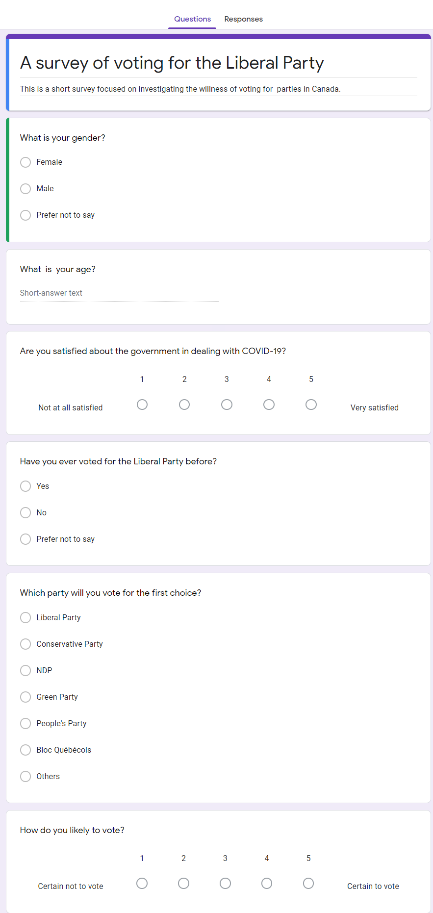

```{r setup, include=FALSE}
knitr::opts_chunk$set(echo = FALSE, warning = FALSE, message = FALSE)
```

## Executive summary


This study mainly investigated the relationship between the satisfaction with the work of the Liberal party in dealing with COVID-19 and favouring Liberal for young voters in Canada's election. This study found that proportions of favouring Liberal in ON for the 2020 election are close for female and male, and the proportions of people voted for Liberal before is little higher than that of people who are not ever voted for Liberal before. More importantly, this study found that there is no significant difference between the two groups of whether satisfied with the work for COVID-19 in proportions of favouring Liberal if the young voters are not voted for Liberal before, but there is a big difference between the two groups of whether satisfied with the work for COVID-19 in proportions of favouring Liberal if the young voters voted for Liberal before. It was found that the proportion of favouring Liberal for young supporters who are satisfied with the work for COVID-19(p = 0.429, SD = 0.084) is much higher than that for young supporters who are not satisfied with the work for COVID-19(p = 0.358, SD = 0.053). Thus, this study suggests the Liberal party should focus more on the work of dealing with COVID-19 as it might be the key to win the 2020 election.


## Introduction

People's health is always one of the most crucial topics in the elections, which would be the same for the 2020 election in Canada. The most critical issue for all of the countries in the world is how to deal with COVID-19. Pagan, C. (2016, August 23) pointed out that the key problem of People's heath would be an immunity challenge. The Goverment Canada, P. (2020, September 13) claimed the spread of COVID-19 in Canada tends to be more and more serious based on the information by the site "Tracking coronavirus' global spread". And it is known that in 2015, young people came out to be the key group to elect Justin Trudeau and the Liberal Party that the young supporters are very important for the Liberal to win the 2020 election in Canada. Similarly, young supporters are the key to win the election for Liberal in Ontario. However, the attitude of young supporters for Liberal might be seriously affected by the COVID-19. Under this background, it is assumed that whether the young voters are satisfied with the work of the Liberal party in dealing with COVID-19 would be the key in the 2020 election in Canada if the Liberal party wants to win. So, this study is mainly aimed to investigate the relationship between the satisfaction of the work of COVID-19 and favouring Liberal for young voters in Canada's election in Ontario. The PDF source of the study could be found in the link: https://github.com/tong304/voting/blob/main/tong_a2.pdf.


## Survey methodology

The survey's objective is to investigate the proportions of favouring Liberal in ON for the 2020 election in two groups for young voters who are aged between 18 and 25 years old. One group is the group of the young voters who are satisfied with the work dealing with COVID-19 of the Liberal party; the other group is the group of the young voters who are not satisfied with the work dealing with COVID-19 of the Liberal party.

Because students are the main group of young voters who are aged between 18 and 25 years old, and they are relatively easier to be investigated. Thus, in this survey, the target population is all of the young Canadian students living in Ontario; the frame is a list of students registered in Ontario. The sample is 1000 Canadian students.

The data needed to be collected in the survey is whether they will vote for Liberal or not in the 2020 election as well as other important related information. The required accuracy of estimates is within 0.2 percent. 

The sampling method selected in the survey is SRSWOR which is a method of selecting n samples out of the N population one by one. In this sampling method, at any stage of the selection, any remaining units have an equal chance of being selected. The details of the sample procedure in the survey are as below:

1). Identify the N students in the population frame with the numbers 1 to N.

2). Choose any random number using R code.

3). Choose the sampling student whose student ID corresponds to the random number drawn
from the step 2).

4). Removing that student from the frame list.

5). Repeat the previous procedures until 1000 students are obtained. 

 
In the sampling method SRSWOR, if we denote the population characteristic of favouring Liberal in ON for the 2020 election as a binary outcome $Y_i$, and if favouring Liberal, $Y_i=1$, otherwise, $Y_i=0$. Then we have the total number with response 1, which means favouring Liberal in ON for the 2020 election in the population is:

$$T = \sum_{i=1}^N Y_i$$

Where N is the population size. The proportion with the response 1 in the population is:

$$P = \frac{T}{N} $$
Now, we denote the sample characteristic of favoring Liberal in ON for 2020 election as a binary outcome $y_i$, and if favoring Liberal, $y_i=1$, otherwise,  $y_i=0$, and the sample size is n = 1000.  The proportion of sample that with the response 1 favoring Liberal in ON for 2020 election is:

$$p = \frac{\sum_{i=1}^n y_i}{n} $$
The sample variance of the proportion using the sampling method SRSWOR is:

$$var(p) = \frac{ p (1-p)}{n - 1}(1 - \frac{n}{N})$$
And as N is much larger than n for this survey, the  sample variance of the proportion could be approximated by:

$$var(p) = \frac{ p (1-p)}{n - 1}$$

The important reason for choosing the sampling method SRSWOR is that it has the most important statistical property for estimators that the sample proportion p is an unbiased estimator of the population proportion P. 

This survey will reach the desired respondents by Mail based on the information of the students registered in the schools in ON. The cost of this survey would be about (10 + 2) * 1000 + 500 = 12500 dollars. We would spend 10 dollars on a gift card and 2 dollars for an envelope for each of the samples. And the left 500 dollars is the fixed cost of the survey design. This survey provides a gift card for each sample, and the survey designed to deal with the non-response problem; because the survey is short, a 10 dollar gift card should be enough for samples to feel it is worth completing the survey. This is important because there are always issues of non-response in the survey; the biggest effect of the non-response issue on the survey is that it would cause non-response bias, making the estimates unreliable. However, sometimes the non-response issue is hard to avoid. Samples might not vote or prefer not to complete the survey even after they accepted the gift card.

Finally, it is essential to protect the respondent's privacy in the survey because the political vote is a very sensitive topic. And this survey would sign a privacy contract and make a copy along with the survey before we could Mail to the samples.

## Results

Table 1 and Figure 1 show the estimated proportions of favouring Liberal in ON for the 2020 election grouped by gender and whether voted for Liberal before. From the table 1 and figure 1, it can be found that for young female voters who are not ever voted for Liberal shows an estimated proportion of favouring Liberal about 0.373 with an SD = 0.042, it is close to the young male voters who are not ever voted for Liberal with estimated proportion of favouring Liberal about 0.361 with an SD = 0.046. And for young female voters who voted for Liberal before, it shows an estimated proportion of selecting Liberal about 0.383 with an SD = 0.063. It is also close to the young male voters who voted for Liberal with an estimated proportion of favouring Liberal about 0.375 with an SD = 0.065. The conclusion is that female and male 
shows close proportions of favouring Liberal in ON for the 2020 election whether they ever voted for Liberal before, whether they ever voted for Liberal before does not matter. And if they ever voted for Liberal before, the proportions of favouring Liberal in ON for the 2020 election would be little higher than those who not ever voted for Liberal.

```{r}
#simulation codes
set.seed(184)
#population size
N <-  500000
#simulate for population features
gender <- sample(c("F","M","NULL"), N, replace = TRUE, prob = c(0.5,0.45,0.05))
age <- round(rnorm(N, mean = 20, sd = 8))
satisfy <- sample(1:5, N, replace = TRUE, prob = c(0.15,0.25,0.3,0.25,0.15))
voted <- sample(c("Y","N","NULL"), N, replace = TRUE, prob = c(0.3,0.65,0.05))
#the choice of party, the same order as the question in the survey
choice <- sample(c("L","C","N","G","P","B","O"), N, replace = TRUE,
                  prob = c(0.35,0.28,0.18,0.08,0.06,0.04,0.01))
likely <- sample(1:5, N, replace = TRUE, prob = c(0.15,0.25,0.3,0.25,0.15))
#population simulated data
pop <- data.frame(gender,age,satisfy,voted,choice,likely)

#SRSWOR
id <- 1:N
n <- 1000 #sample size
#SRSWOR sampling
ids <- sample(1:N,n,replace = FALSE)
#the simulated survey SRSWOR sample
samp <- pop[ids, ]
```


```{r}
#the cleaning of data
library(dplyr)
#extract samples of young voters 18-25 and has gender, voted answers
#also convert satisfication score to a binary outcome No or Yes, No = <= 3, Yes = >=4
data <- samp %>% mutate(satisfied = ifelse(satisfy < 4, "N", "Y")) %>%
         filter(18 <= age & age <= 25 & gender != "NULL" & voted != "NULL") 
```


```{r, fig.cap="An investigation of estimated proportions of favoring Liberal (95%CI) in ON for 2020 election grouped by gender(F=female,M=male) and whether voted for Liberal before",fig.height=3.7,fig.width=5.2}
#graphs
library(ggplot2)
#compute estimated proportions of favoring Liberal with sd grouped by gender and voted
dt <- data %>% group_by(gender, voted) %>% summarise(m = mean(choice == "L",na.rm=TRUE),
                                                      s = sd(choice =="L",na.rm=TRUE)/sqrt(n()))
#plot it using error bar plot
p = ggplot(dt, aes(x=voted, y=m, colour=gender,group=gender)) + 
  geom_errorbar(aes(ymin=m-1.96*s, ymax=m+1.96*s), width=0.1) +
  geom_line(size = 1.3) +
  geom_point(size = 2) +
  theme_classic() + xlab("Whether Voted for Liberal before(N=No,Y=Yes)") + ylab("Estimated proportion of favoring Liberal (95%CI)") + 
  theme(legend.position=c(0.95,0.75)) + 
  scale_color_manual(values =c("#00b0f6","#f8766d")) + ylim(0,1) + 
  ggtitle("Proportions of favoring Liberal for young voters",
          subtitle = "grouped by gender and whether voted Liberal before")
p
```

```{r}
#rename
colnames(dt)[3:4] <- c("mean","SD")
dt[,3:4] <- round(dt[,3:4],3)
#make the table
knitr::kable(dt,caption = "Estimated proportion of favoring Liberal (95%CI) grouped by gender and whether voted for Liberal before")
```

Table 2 and Figure 2 show the estimated proportions of favouring Liberal in ON for the 2020 election grouped by whether satisfied with the work for COVID-19 and whether voted for Liberal before. The original scale of satisfaction is a linear scale from 1 to 5. In this part, it is converted into a binary outcome group that the satisfaction group is the group which shows a score no less than 4 while the non-satisfaction group is the group which shows a score no higher than 3. 

From the table 2 and figure 2, it can be found that for satisfied young voters who are not ever voted for Liberal shows an estimated proportion of favouring Liberal about 0.374 with an SD = 0.051, it is very close to the not satisfied young voters who are not ever voted for Liberal shows an estimated proportion of favouring Liberal about 0.364 with an SD = 0.039. And for satisfied young voters who voted for Liberal before shows an estimated proportion of favouring Liberal about 0.429 with an SD = 0.084, it is higher than the not satisfied young voters who voted for Liberal with estimated proportion of favouring Liberal about 0.358 with an SD = 0.053. The conclusion is that there is no significant difference between the two groups of whether satisfied with the work for COVID-19 in proportions of favouring Liberal if the young voters are not ever voted for Liberal. However, there is a big difference between the two groups of whether satisfied with the work for COVID-19 in proportions of favouring Liberal if the young voters voted for Liberal before. 

```{r, fig.cap="An investigation of estimated proportions of favoring Liberal (95%CI) in ON for 2020 election grouped by satisfication of work for COVID-19(N= score <= 3,Y = score >= 4) using a linear scale 1-5 and whether voted for Liberal before",fig.height=3.7,fig.width=5.2}
#compute estimated proportions of favoring Liberal with sd grouped by satisfied and voted
dt2 <- data %>% group_by(satisfied , voted) %>% summarise(m = mean(choice == "L",
                                                                   na.rm=TRUE),
                                                      s = sqrt(m*(1-m)/n()) )
#plot it
p = ggplot(dt2, aes(x=voted, y=m, colour=satisfied ,group=satisfied )) + 
  geom_errorbar(aes(ymin=m-1.96*s, ymax=m+1.96*s), width=0.1) +
  geom_line(size = 1.3) +
  geom_point(size = 2) +
  theme_classic() + xlab("Whether Voted for Liberal before(N=No,Y=Yes)") + ylab("Estimated proportion of favoring Liberal (95%CI)") + 
  theme(legend.position=c(0.95,0.75)) + 
  scale_color_manual(values =c("#00b0f6","#f8766d")) + ylim(0,1)+ 
  ggtitle("Proportions of favoring Liberal for young voters",
subtitle = "grouped by satisfication of work for COVID-19 and whether voted Liberal before")
p
```

```{r}
#rename and make the table
colnames(dt2)[3:4] <- c("mean","SD")
dt2[,3:4] <- round(dt2[,3:4],3)
knitr::kable(dt2,caption = "Estimated proportion of favoring Liberal (95%CI) grouped by satisfication and whether voted for Liberal before")
```


## Discussion


The founding of the above shows that for the young voters aged between 18 to 25, female and male shows close proportions of favouring Liberal in ON for the 2020 election, whether they ever voted for Liberal before does not matter. And if they ever voted for Liberal before, the proportions of favouring Liberal in ON for the 2020 election would be little higher than those who not ever voted for Liberal. The founding also shows there is no significant difference 
between the two groups of whether satisfied with the work for COVID-19 in proportions of favouring Liberal if the young voters are not voted for Liberal before, but there is a big difference between the two groups of whether satisfied with the work for COVID-19 in proportions of favouring Liberal if the young voters voted for Liberal before. However, there are some potential weaknesses in this study. First, as this survey applied the sampling method SRSWOR, there is a problem in the lack of listing frame, which means the SRSWOR requires a population list to be available. But for this case, the ideal target population is not available. For example, there might be many cases confirmed by the COVID-19 and can not be investigated in the survey. Second, there is still non-response bias because for the sampling method SRSWOR of this study, mail is used to implement the survey; there might be samples do not want to complete the survey. Third, the total sample size is 1000 in the survey. However, some of the samples collected in the survey might not be interested in the study; for example, if samples do not answer the questions that which party to vote or whether they voted for the Liberal party before, we may not consider them. Thus, the study's actual sample size is less than 1000, which might not be enough if we want the results to be reliable based on a relatively large sample size. Fourth, this study used a satisfication threshold score 4 in a linear scale 1-5 which might be little higher than expected, for example, a satisfication threshold score 3 could also be considered. Fifth, the study is based on a simulation study, the details of simulation process might be not as the same as the real world. Sixth, not all of the answers collected are used, for example, the likely to vote score is not investigated in this study. However, to improve the results, this might be used as weights to estimate the proportions of favouring Liberal. Last, the order of questions might be necessary for this survey. For example, the relative ranking of the question of whether satisfied by work in dealing with COVID-19 and which party to vote might be essential as for some sample units, and they might think the question of whether satisfied by work in coping with COVID-19 might remind them that the Liberal party did not work well. Thus they might not vote for the Liberal party. So in the future study, these issues could be further discussed to improve the results obtained.


## References

1. Canada, P. (2020, September 13). Government of Canada. Retrieved September 30, 2020, from https://www.canada.ca/en/public-health/services/diseases/2019-novel-coronavirus-infection.html

2. Hadley Wickham, Romain Franois, Lionel Henry and Kirill Muller (2019). dplyr: A Grammar of Data Manipulation. R package version 0.8.3. https://CRAN.R-project.org/package=dplyr

3. H. Wickham. ggplot2: Elegant Graphics for Data Analysis. Springer-Verlag New York, 2016.

4. JJ Allaire and Yihui Xie and Jonathan McPherson and Javier Luraschi and Kevin Ushey and Aron Atkins and Hadley Wickham and Joe Cheng and Winston Chang and Richard Iannone (2020). rmarkdown: Dynamic Documents for R. R package version 2.1. URL https://rmarkdown.rstudio.com.

5. Pagan, C. (2016, August 23). The Immunity Challenge: How aging affects your immune system. Retrieved September 30, 2020, from https://www.webmd.com/healthy-aging/guide/seniors-boost-immunity

6. R Core Team (2019). R: A language and environment for statistical computing. R Foundation for Statistical Computing, Vienna, Austria. URL https://www.R-project.org/

7. Tracking coronavirus' global spread. (n.d.). Retrieved September 30, 2020, from https://www.cnn.com/interactive/2020/health/coronavirus-maps-and-cases/

8. Yihui Xie (2014) knitr: A Comprehensive Tool for Reproducible Research in R. In Victoria Stodden, Friedrich Leisch and Roger D. Peng, editors, Implementing Reproducible Computational Research. Chapman and Hall/CRC. ISBN 978-1466561595

## Appendix

The survey link is: https://docs.google.com/forms/d/1A9hBwoQjdfLYTZhowoLbP8l5n_cuIhU0owff3vu8FpY/edit

The Github repo link of source codes in a rmd format is:  https://github.com/tong304/voting.

The screenshot of the survey is as below:




